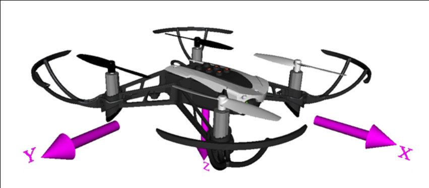

# Table of Contents

1.  [Parrot Mambo Drone Info](#orgac10d18)
    1.  [Sensors](#org3af9999)
        1.  [Inertial Measurement Unit](#org60a0542)
        2.  [Ultrasound sensor](#org2ddaa02)
        3.  [Pressure sensor](#orgd072cfc)
    2.  [Cameras](#org8332080)
        1.  [Downward facing camera](#org3328419)
        2.  [Streaming Camera](#org5d5a2ac)
    3.  [Physical Characteristics](#org78ab3bc)
        1.  [Weight](#orge5fa27c)
        2.  [Dimensions](#org9561dc6)
        3.  [Rotor Characteristics](#org99c709b)
    4.  [Miscellaneous](#org4409a5f)
        1.  [Energy](#orge5e9251)
        2.  [SDK](#orga11d63b)

<https://www.mathworks.com/academia/student-competitions/minidrones/matlab-expo-uk-2020.html>
Addon Toolboxes to Install:

1.  Navigation
2.  Control System
3.  Computer Vision
4.  Image Processing

# Parrot Mambo Drone Info

Mostly information on what sensor information we have and as a way to document stuff.

## Sensors

### Inertial Measurement Unit

Inertial Measurement Unit to evaluate speed, tilt and obstacle contact

-   3-axis accelerometer
-   3-axis gyroscope

Definitely need to get accurate specs for this.
The Parrot AR Drone had pretty good IMU chips so pretty sure that even a "low-cost" model should have something with:

-   accelerometer +-2g
-   Bandwidth ~1000Hz
-   Low cross-axis misalignment

Not sure how Mathworks's Simulink package deals with the hardware flags but should be interesting to see.

1.  Accelerometer Characterization

    -   Bias factor
    -   Scale factor
    -   Thermal drift (check if it's relevant? Should be a simple correction)

### Ultrasound sensor

Useful in determining altitude over a horizontal surface but susceptible to absorption by carpet. Calibrate before trusting.

Might actually be useless? Maybe useful in determing relative distance off the ground and as a way to not have to rely on the downward facing camera while landing.

### Pressure sensor

As of right now, deemed to be useless!

## Cameras

### Downward facing camera

60 FPS vertical camera
120x160 pixel resolution
Ultrasound sensor

-   Do we need to worry about the actual picture being distorted?
    OpenCV has a little camera calibration thingy that takes care of camera distortion.
    A chessboard pattern? Something similar here would be sweet.

### Streaming Camera

Streaming and Recording HD 720p 30 FPS
FOV 120°

## Physical Characteristics

Need to get a MoI matrix from this

### Weight

Weight: 2.22 oz / 63g (without bumpers or accessories)
Weight with Camera: 73g

### Dimensions

7.1 x 7.1 in. / 18 x 18 cm with Bumpers

### Rotor Characteristics

Right-hand Coordinate Frame centered at Center of gravity.

Rotor #1 rotates positively with respect to the z-axis. It is located parallel to the xy-plane, -45 degrees from the x-axis.

Rotor #2 rotates negatively with respect to the body's z-axis. It is located parallel to the xy-plane, -135 degrees from the x-axis.

Rotor #3 has the same rotation direction as rotor #1. It is located parallel to the xy-plane, 135 degrees from the x-axis.

Rotor #4 has the same rotation direction as rotor #2. It is located parallel to the xy-plane, 45 degrees from the x-axis.

## Miscellaneous

### Energy

660mAh LiPo Battery
8 min autonomy with accessory connected or bumpers
10 min autonomy with neither accessory nor bumpers
30 min charging time with a 2,1A charger

### SDK

SDK: OS Linux. SDK available on Parrot.com
We might find documentation useful, especially if the Simulink model neglects to mention something.
